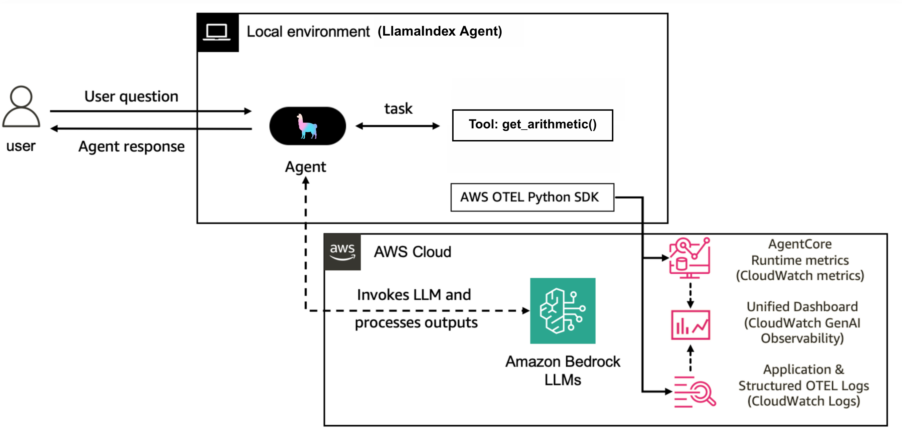

# LlamaIndex Function Agent with AWS Bedrock and OpenTelemetry

This project demonstrates how to create a simple arithmetic agent using LlamaIndex, hosted on AWS Bedrock with OpenTelemetry instrumentation for AgentCore observability tracing.

## Project Overview

This project implements:
- A Function agent pattern using LlamaIndex.core's FunctionAgent
- Integration with AWS Bedrock's Claude model for the LLM backend
- OpenTelemetry instrumentation for observability with AWS CloudWatch
- Simple arithmetic tools (add and multiply)
- Session tracking capabilities for correlating traces across multiple agent runs

## Architecture Diagram

The following diagram illustrates the architecture of this LlamaIndex agent implementation with AWS Bedrock and OpenTelemetry:



## Prerequisites

- Python 3.9+
- AWS account with access to Bedrock service (specifically Claude models)
- AWS credentials configured locally
- Appropriate IAM permissions for AWS Bedrock and CloudWatch
- CloudWatch Transaction Search enabled (for viewing traces)

## Installation

1. If you've cloned the entire Amazon Bedrock AgentCore Samples repository:
```bash
git clone https://github.com/aws-samples/amazon-bedrock-agentcore-samples.git
cd amazon-bedrock-agentcore-samples/01-tutorials/06-AgentCore-observability/02-Agent-not-hosted-on-runtime/LlamaIndex
```

2. Create and activate a virtual environment:
```bash
# Create a virtual environment
python -m venv venv

# Activate the virtual environment
# On Windows
venv\Scripts\activate
# On macOS/Linux
source venv/bin/activate
```

3. Install dependencies:
```bash
pip install -r requirements.txt
```


4. When opening the notebook in Jupyter or VS Code:
   - Select the "venv" kernel from the kernel selector
   - If the kernel doesn't appear in the list, restart Jupyter or VS Code

## Configuration

### AWS Credentials

Ensure your AWS credentials are properly configured with access to AWS Bedrock and CloudWatch:

Run ```aws configure``` in your CLI to correctly configure your Amazon credentials. No need to store them in your .env file

### OpenTelemetry Configuration

The project uses the following OpenTelemetry environment variables, which should be set in a `.env` file (use `.env.example` as a template):

```bash
# Agent Configuration
AGENT_ID=llama-index-function-agent
SERVICE_NAME=llama-index-bedrock-agent
BEDROCK_MODEL_ID=anthropic.claude-3-haiku-20240307-v1:0

# OpenTelemetry Configuration
AGENT_OBSERVABILITY_ENABLED=true
OTEL_PYTHON_DISTRO=aws_distro
OTEL_PYTHON_CONFIGURATOR=aws_configurator
OTEL_EXPORTER_OTLP_PROTOCOL=http/protobuf
OTEL_TRACES_EXPORTER=otlp

# Optional: Custom OTLP endpoint (default: http://localhost:4318/v1/traces)
# OTEL_EXPORTER_OTLP_ENDPOINT=http://custom-endpoint:4318/v1/traces
```

### CloudWatch Log Group Setup

Before running the agent, you need to create a log group and log stream in CloudWatch:

```python
import boto3

cloudwatch_client = boto3.client("logs")
cloudwatch_client.create_log_group(logGroupName='agents/llama-index-agent-logs')
cloudwatch_client.create_log_stream(logGroupName='agents/llama-index-agent-logs', logStreamName='default')
```

Then update your `.env` file to include:

```bash
OTEL_EXPORTER_OTLP_LOGS_HEADERS=x-aws-log-group=agents/llama-index-agent-logs,x-aws-log-stream=default,x-aws-metric-namespace=bedrock-agentcore
OTEL_RESOURCE_ATTRIBUTES=service.name=agentic-llamaindex-agentcore
```

## Usage

### Basic Agent

To run the basic arithmetic agent with OpenTelemetry instrumentation:

```bash
opentelemetry-instrument python llama_index_agent.py
```

This will execute a simple arithmetic task: `What is (121 + 2) * 5?`

### Session-Tracked Agent

To run the agent with session tracking for trace correlation:

```bash
opentelemetry-instrument python llama_index_agent_with_session.py --session-id "your-session-id"
```

This version allows you to correlate traces across multiple agent runs by using a consistent session ID.

## Jupyter Notebook Tutorial

The repository includes a Jupyter notebook (`llama_index_setup.ipynb`) that demonstrates:

1. Setting up the environment and prerequisites
2. Creating the necessary CloudWatch log groups
3. Configuring environment variables
4. Running the agent with and without session tracking
5. Understanding the traces in the AWS CloudWatch dashboard

The notebook serves as an interactive tutorial for setting up and running the agent with proper observability.

## OpenTelemetry Instrumentation Details

This project uses AWS Distro for OpenTelemetry (ADOT) to send telemetry data to AWS CloudWatch. The instrumentation is set up using the `LlamaIndexOpenTelemetry` class from `llama_index.observability.otel`.

Key instrumentation points:
- Agent initialization
- LLM calls to AWS Bedrock
- Tool execution (each tool has its own span)
- Agent query processing

### About the OpenTelemetry Endpoint

The OTLP endpoint configuration works as follows:

- **Local development**: By default, when running locally, the agent uses `http://localhost:4318/v1/traces`. This assumes you have a local OpenTelemetry Collector running on port 4318.

- **AWS environment**: When running in AWS, the code will automatically detect the AWS environment and use the AWS X-Ray OTLP endpoint.

- **Custom endpoint**: You can set a custom endpoint by configuring the `OTEL_EXPORTER_OTLP_ENDPOINT` environment variable.

### Session Tracking

The agent supports session tracking using OpenTelemetry baggage:

```python
from opentelemetry import baggage, context

# Set session context
ctx = baggage.set_baggage("session.id", session_id)
token = context.attach(ctx)

# ... agent execution ...

# Detach context when done
context.detach(token)
```

This allows you to correlate multiple agent runs and API calls within a single user session.

### Viewing Traces

To view the traces:
1. Ensure CloudWatch Transaction Search is enabled
2. Navigate to the CloudWatch console
3. Go to Application Signals (APM) > Transaction search
4. Look for traces with your agent's service name (default: `agentic-llamaindex-agentcore`)

The repository includes example screenshots of the CloudWatch dashboard in the `images/` directory:
- `llama_index_sessions.png`: Shows the sessions view
- `llama_index_traces.png`: Shows the traces list view
- `llama_index_trace_details.png`: Shows detailed trace information

### Setting Up a Local Collector (Development)

For local development, you may want to run an OpenTelemetry Collector. You can use the AWS Distro for OpenTelemetry Collector (ADOT):

```bash
docker run -p 4318:4318 -p 4317:4317 \
  -v $(pwd)/collector-config.yaml:/etc/otelcol/config.yaml \
  amazon/aws-otel-collector
```

Where `collector-config.yaml` contains your collector configuration with AWS exporters.

## AWS Bedrock Integration

The agent uses AWS Bedrock as the LLM backend. The integration is handled by the `get_bedrock_model()` function in both agent implementations:

```python
def get_bedrock_model():
    model_id = os.getenv("BEDROCK_MODEL_ID", "anthropic.claude-3-haiku-20240307-v1:0")
    region = os.getenv("AWS_DEFAULT_REGION", "us-west-2")
    
    try:
        # Let boto3 handle credential resolution automatically
        bedrock_model = BedrockConverse(
            model=model_id,
            region_name=region,
            # No explicit credentials - boto3 will find them automatically
        )
        logger.info(f"Successfully initialized Bedrock model: {model_id} in region: {region}")
        return bedrock_model
    except Exception as e:
        logger.error(f"Failed to initialize Bedrock model: {str(e)}")
        logger.error("Please ensure you have proper AWS credentials configured and access to the Bedrock model")
        raise
```

To use a different Bedrock model, set the `BEDROCK_MODEL_ID` environment variable before running the agent.

## Troubleshooting

### Common Issues

1. **AWS Credentials Not Found**
   - Ensure AWS credentials are correctly set in your environment
   - Verify your IAM user has appropriate permissions for Bedrock and CloudWatch

2. **OpenTelemetry Traces Not Appearing**
   - Verify CloudWatch Transaction Search is enabled
   - Check that the log group specified in `OTEL_EXPORTER_OTLP_LOGS_HEADERS` exists
   - Ensure AWS region is correctly set

3. **Bedrock Model Access**
   - Verify you have access to the Bedrock model specified in `BEDROCK_MODEL_ID`
   - Check Bedrock model throughput quotas for your account

4. **OpenTelemetry Warnings in Jupyter Notebooks**
   - When running `opentelemetry-instrument` in Jupyter notebook cells, you may see warnings like:
     ```
     WARNING:opentelemetry.trace:Overriding of current TracerProvider is not allowed
     ```
     or messages about `SpanDropEvent` and spans exiting with errors.
   - These warnings are expected in notebook environments and don't affect the agent's functionality or observability data collection
   - They occur because Jupyter has its own instrumentation context, and running cells multiple times can cause OpenTelemetry to attempt re-registering
   - You can safely ignore these warnings as long as your agent executes correctly and traces appear in CloudWatch

### CloudWatch Log Groups

The OpenTelemetry traces are sent to a CloudWatch log group specified in your environment variables:
```
agents/llama-index-agent-logs
```

If traces are not appearing, ensure this log group exists and is properly configured in your `.env` file.

## Next Steps

Now that you have a basic understanding of LlamaIndex with OpenTelemetry set up, you can:

1. **Add More Complex Tools**: Enhance your agent with additional tools beyond simple arithmetic
2. **Create Multi-agent Architectures**: Build systems with multiple specialized agents
3. **Implement Custom Metadata**: Add business-specific metadata to your traces for better analysis
4. **Set Up CloudWatch Alarms**: Create alarms on key metrics like latency and token usage

## Additional Resources

- [LlamaIndex Documentation](https://docs.llamaindex.ai/)
- [AWS Bedrock Documentation](https://docs.aws.amazon.com/bedrock)
- [OpenTelemetry Documentation](https://opentelemetry.io/docs/)
- [AWS Distro for OpenTelemetry (ADOT)](https://aws.amazon.com/otel/)
- [CloudWatch Transaction Search Documentation](https://docs.aws.amazon.com/AmazonCloudWatch/latest/monitoring/Enable-TransactionSearch.html)
